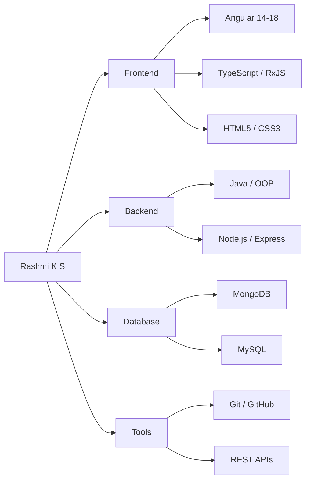
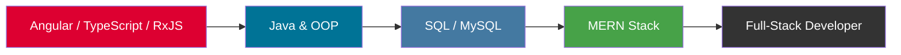
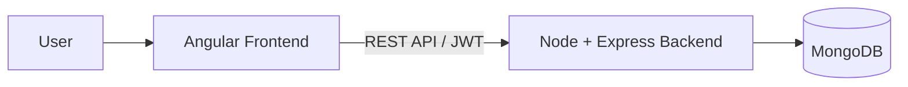
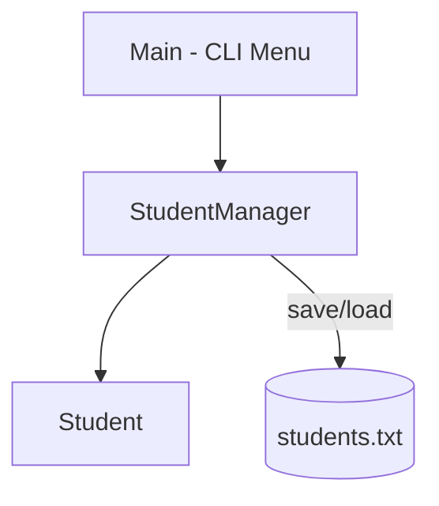

# Hi there, I'm Rashmi K S 👋

🅰️ Angular Developer | 💻 TypeScript, JavaScript & Java | 🚀 Open to new opportunities
📍 Bangalore, Karnataka

- 🔭 **Focused** on building production-grade Angular applications — specializing in reusable components, custom directives, RxJS data streams, and state optimization.
- 🌱 **Expanding Full-Stack Proficiency** — currently mastering Java, SQL, and the MERN stack ecosystem (GUVI x HCL) while deepening my foundational expertise in Angular and TypeScript (MEAN stack).
- 💼 **Actively looking** for a frontend or full-stack developer role.
- 📫 **Connect with me** via [LinkedIn](https://www.linkedin.com/in/rashmiks-dev/) or explore my featured engineering work below.

 

## 🛠️ Tech Stack

 

## 🧭 Skill Map

 

## 🗺️ Learning Roadmap

 

## 📌 Featured Projects

### 📊 Employee Management System (Full-Stack MEAN App)
A robust, full-stack employee management platform featuring secure token-based authentication and a responsive data dashboard.

- 🔹 **Frontend Features:** Configured secure client-side Route Guards, dynamic data tables, and structured an HTTP Interceptor workflow to seamlessly attach JWT tokens across outgoing requests.
- 🔹 **Backend Features:** Built a modular RESTful API architecture using Express.
- 📁 **Client Repository:** [mini-project](https://github.com/Rashmi92-ha/mini-project) | 🌐 [Live App Demo](https://mini-project-iota-rosy.vercel.app)
- 📁 **Server Repository:** [mini-project-backend](https://github.com/Rashmi92-ha/mini-project-backend) | 🌐 [Live API Endpoint](https://mini-project-backend-v057.onrender.com)

### ☕ Student Management System (CLI Program)
A scalable, console-driven Java application built entirely around robust architectural foundations to manage student records efficiently.

- 🔹 **Key Implementations:** Engineered utilizing strict Object-Oriented Programming (OOP) methodologies, the Java Collections Framework (`ArrayList`), and native File I/O pipelines to persist state data reliably across separate program lifecycles.
- 📁 **Repository:** [StudentManagementSystem](https://github.com/Rashmi92-ha/StudentManagementSystem)

 

## 📊 GitHub Analytics

  

### 📌 Summary Snapshot
- 📦 Maintaining **9+ active public repositories** hosting varied frontend and full-stack modules.
- ⚙️ Actively creating custom full-stack solutions using **Angular (MEAN stack)** architectures.
- 📈 Continuing to widen technical scope by onboarding **Java, SQL foundations, and the MERN stack**.
